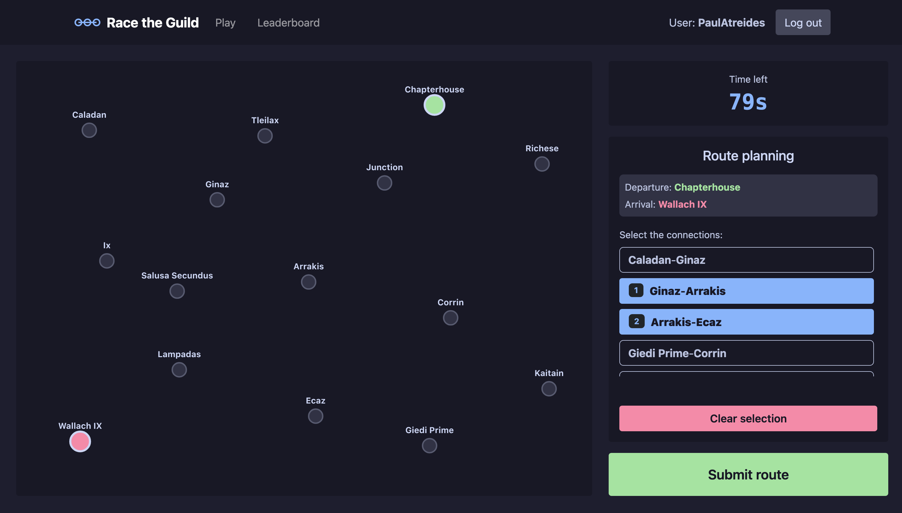
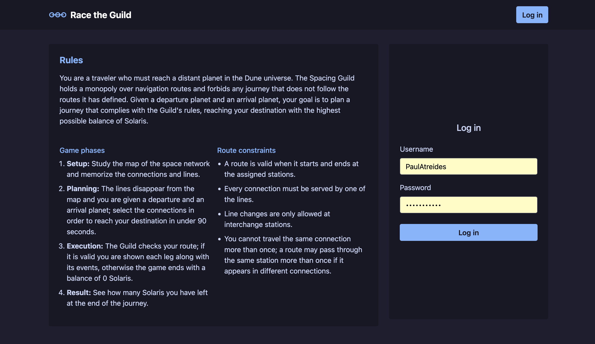

# Race the Guild

A route-planning game set in the Dune universe: memorize the Spacing Guild's network of lines, then plan a valid route between two planets against the clock and reach your destination with as many Solaris as possible.

## React Client Application Routes

- Route `/`: The landing page. It shows the game instructions and the login form; once logged in, it shows the options to view the leaderboard or start a new game.
- Route `/play`: The main game page, available only to logged-in users. It handles the 4 phases of the game, rendering the map accordingly.
- Route `/leaderboard`: The leaderboard page, available only to logged-in users.

## API Server

- GET `/api/sessions/current`
  - request parameters: Session cookie
  - response status: `200 OK` (success), `401 Unauthorized`
  - response body example: `{ "id": 1, "username": "PaulAtreides" }`

- POST `/api/sessions`
  - request parameters: none
  - request body: `{ "username": "PaulAtreides", "password": "LisanAlGaib" }`
  - response status: `200 OK` (success), `401 Unauthorized` (wrong credentials)
  - response body example: `{ "id": 1, "username": "PaulAtreides" }`

- DELETE `/api/sessions/current`
  - request parameters: Session cookie
  - response status: `200 OK` (logout completed)
  - response body: empty.

- GET `/api/network`
  - request parameters: none
  - response status: `200 OK` (success), `500 Internal Server Error`
  - response body example: 
    ```
    {
      "stations": [
        { "id": 1, "name": "Caladan" },
        { "id": 2, "name": "Ginaz" }
      ],
      "lines": [
        { "id": 1, "name": "Atreides Line", "color": "#a6e3a1" }
      ],
      "connections": [
        { "id": 1, "station1_id": 1, "station2_id": 2, "line_id": 1 }
      ]
    }
    ```

- GET `/api/leaderboard`
  - request parameters: Session cookie
  - response status: `200 OK` (success), `401 Unauthorized`, `500 Internal Server Error`.
  - response body example:
    ```
    [
      { "username": "PaulAtreides", "best_score": 24 },
      { "username": "BaronHarkonnen", "best_score": 22 }
    ]
    ```

- POST `/api/games`
  - request parameters: Session cookie
  - response status: `200 OK` (game created), `401 Unauthorized` (user is not logged in), `500 Internal Server Error`.
  - response body example:
    ```
    {
      "startStation": { "id": 1, "name": "Caladan" },
      "endStation": { "id": 15, "name": "Corrin" }
    }
    ```

- POST `/api/games/submit`
  - request parameters: Session cookie
  - request body: `{ "path": [1, 2, 3, 15] }`
  - response status: `200 OK` (validation completed), `401 Unauthorized` (login required), `400 Bad Request` (no game in progress), `500 Internal Server Error`.
  - response body example:
    ```
    {
      "valid": true,
      "score": 18,
      "steps": [
        {
          "from": "Caladan",
          "to": "Ginaz",
          "event": { "id": 1, "description": "Smooth journey", "effect": 0 },
          "coins": 20
        },
        {
          "from": "Ginaz",
          "to": "Arrakis",
          "event": { "id": 8, "description": "Sardaukar patrol", "effect": -2 },
          "coins": 18
        }
      ]
    }
    ```

## Database Tables

- Table `users` - Contains the credentials and data of registered users: username, hashed password and salt
- Table `stations` - Contains the stations, with id and name
- Table `lines` - Contains the lines, with id, name and the color used to draw them on the map
- Table `connections` - Contains all the connections between stations, stored bidirectionally (both 2-1 and 1-2); each connection has its own id, the ids of the two stations and the id of the line it belongs to
- Table `events` - Contains the events that can randomly occur during the journey, with id, description and effect
- Table `games` - Contains all completed games, each with its id, the id of the user who played it and the score

## Main React Components

- `NavigationBar` (in `NavigationBar.jsx`): Navigation bar containing the game logo, the user's username with a logout button (or a login button), and buttons to switch pages.
- `LoginForm` (in `Login.jsx`): Input form that handles user login.
- `Play` (in `Play.jsx`): Main component managing the game; most of the game state and handler functions are defined here and passed down to its subcomponents
- `GameMap` (in `GameMap.jsx`): SVG component that renders the game map differently depending on the game phase
- `ConnectionSelector` (in `ConnectionSelector.jsx`): List of bidirectional connections the user can select to build their route
- `GameTimer` (in `GameTimer.jsx`): Component that manages the client-side timer shown to the user
- `ExecutionView` (in `ExecutionView.jsx`): Component that shows the user each leg of their journey, with its events, during the execution phase.
- `ResultView` (in `ResultView.jsx`): Results of the game just completed, with a button to start another one.
- `Leaderboard` (in `Leaderboard.jsx`): Overall leaderboard of all users who have played at least one game.

## Screenshots




## Users Credentials

- PaulAtreides, LisanAlGaib
- BaronHarkonnen, Spice123
- DuncanIdaho, CantDie200
- LadyJessica, Sisterhood
- MilesTeg, MentatGeneral
